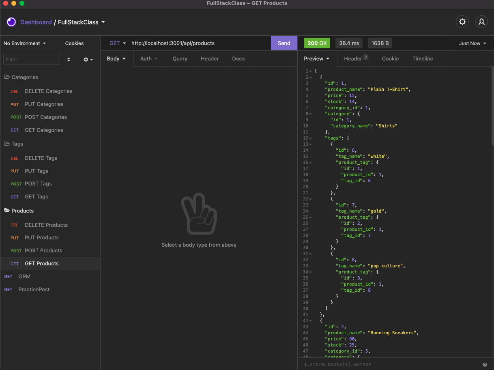

# ORM_E-commerceBackend_VGUTIERREZ

Homework 13 - Object Relational Mapping - E-Commerce Back End

# Description

This project is a back end for an e commerce website. It uses Express.js and sequelize to interact with the MySQL database.

# Table of Contents

- [Installation](#installation)
- [Usage](#usage)
- [License](#license)
- [Contributers](#contributers)
- [Test Instructions](#test-instructions)
- [Questions](#questions)

# Installation

This is the first installation of this tool.

# Usage

- This tool is for a business owner to keep track of their products in their system.

# License

- MIT

# Contributers

- Vinette Gutierrez

# Test Instructions

Use "npm i" to install dependencies.
Run the seeds using "npm run seed."
Start application by running "npm start"

After this is completed in the command line, move into insomnia to see the routes in action.

# Questions

- [Github Link](https://github.com/vinetteg/ORM_E-commerceBackend_VGUTIERREZ)
- For additional questions, please contact me via email at vinette.gutierrez@gmail.com
